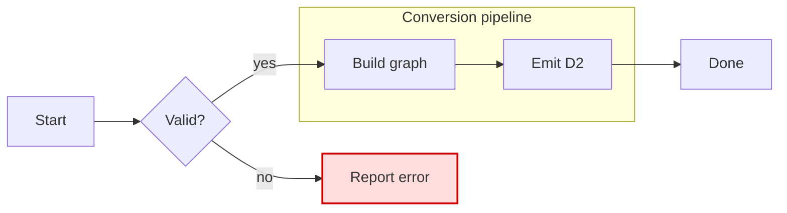
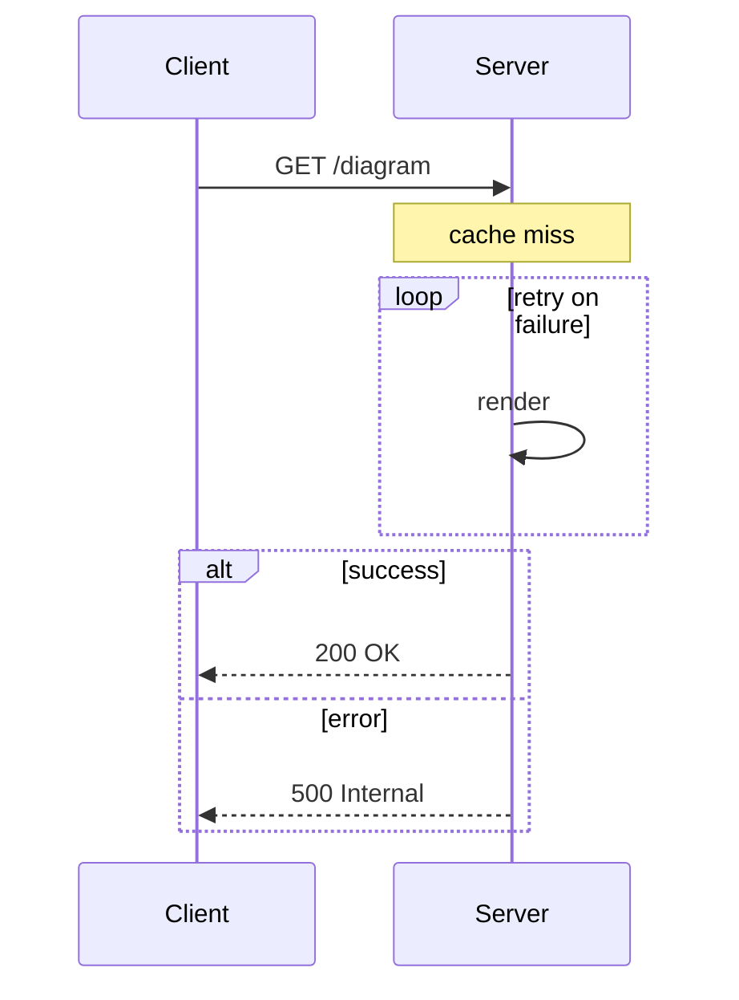
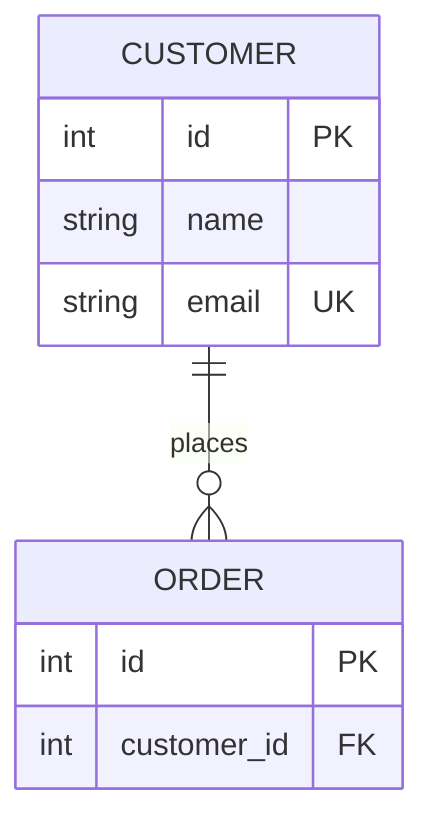
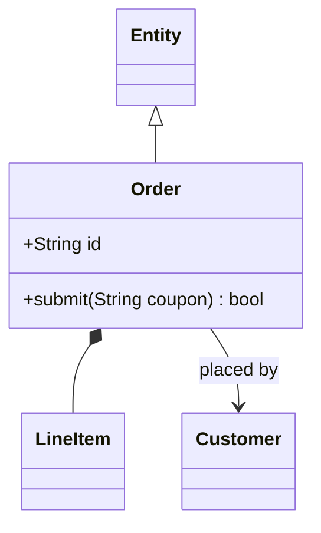
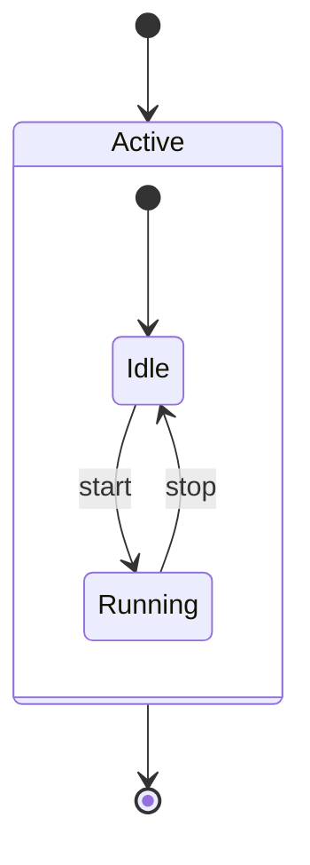

# mermaid2d2

Convert between [D2](https://d2lang.com) and [Mermaid](https://mermaid.js.org)
diagram syntax, as a Go library and a CLI (`m2d2`).

## Coverage

✅ supported · 🚧 planned · ❌ no equivalent in the other format

### Mermaid → D2

| Diagram | | Maps to |
|---|:--:|---|
| `flowchart` / `graph` | ✅ | shapes · edge styles · subgraphs · colors |
| `sequenceDiagram` | ✅ | messages · loop/alt/opt groups · notes |
| `stateDiagram-v2` | ✅ | states · transitions · composites · start/end |
| `classDiagram` | ✅ | members · UML arrowheads |
| `erDiagram` | ✅ | `sql_table` · keys · cardinalities |
| `mindmap` | ✅ | node tree · shapes |
| `C4Context`/`C4Container`/`C4Component`/`C4Dynamic`/`C4Deployment` | ✅ | elements → nodes · boundaries → containers · `Rel` → connections |
| pie · gantt · journey · xychart · gitGraph | ❌ | no D2 graph analog |

### D2 → Mermaid

| Feature | | Maps to |
|---|:--:|---|
| nodes · containers · connections · direction | ✅ | `flowchart` |
| `sql_table` | ✅ | `erDiagram` · keys · cardinalities |
| `class` | ✅ | `classDiagram` · members · UML arrowheads |
| `classes:`/`class:` styling | ✅ | flowchart `classDef`/`class` |
| mixed `sql_table`/`class`/plain shapes | ❌ | no single Mermaid diagram type |
| grids | ❌ | no Mermaid equivalent |

### Features

| | | |
|---|:--:|---|
| Label quoting (special chars) | ✅ | auto-quoted |
| Flowchart `classDef`/`class` colors | ✅ | ↔ D2 `classes` |
| State / class diagram notes | ✅ | `tooltip` on the target; standalone class notes as floating nodes |
| Inline `style` · `:::class` | ✅ | `style.*` on the node · `:::x` → `class: x` (Mermaid → D2) |
| Sequence note side · spans · mindmap icons | ❌ | no D2 counterpart |
| C4 diagram title · sprites · tags · links · `UpdateElementStyle`/`UpdateRelStyle` | ❌ | no D2 counterpart; D2 has no native C4 notation |

## Examples

Each example is the Mermaid source — rendered inline by GitHub — followed by the
D2 that `m2d2` produces from it, rendered to SVG. Click a diagram to open it
full size. Regenerate the renders with
[`docs/examples/generate.sh`](docs/examples/generate.sh).

The renders use `d2 --layout=elk`. Layout is the renderer's choice rather than
anything this tool emits, but ELK places a composite state's terminal node below
its container, where the default dagre layout puts it off to one side.

### Flowchart



<details>
<summary><code>m2d2 -to d2</code> output</summary>

```d2
direction: right
classes: {
  error: {
    style: {
      fill: "#fdd"
      stroke: "#c00"
      stroke-width: 2
      font-color: "#333"
    }
  }
}
Parse: Valid? {shape: diamond}
Fail: Report error {class: error}
pipeline: Conversion pipeline {
  Build: Build graph
  Emit: Emit D2
  Build -> Emit
}
Start -> Parse
Parse -> pipeline.Build: yes
Parse -> Fail: no
pipeline.Emit -> Done
```

</details>

<a href="docs/examples/flowchart.d2.svg"></a>

### Sequence



<details>
<summary><code>m2d2 -to d2</code> output</summary>

```d2
shape: sequence_diagram
C: Client
S: Server
C -> S: GET /diagram
S.note_1: cache miss
loop_1: {
  label: retry on failure
  S -> S: render
}
alt_1: {
  label: alt
  case_1: {
    label: success
    S -> C: 200 OK
  }
  case_2: {
    label: error
    S -> C: 500 Internal
  }
}
```

</details>

<a href="docs/examples/sequence.d2.svg"></a>

### Entity relationship



<details>
<summary><code>m2d2 -to d2</code> output</summary>

```d2
CUSTOMER: {
  shape: sql_table
  id: int {constraint: primary_key}
  name: string
  email: string {constraint: unique}
}
ORDER: {
  shape: sql_table
  id: int {constraint: primary_key}
  customer_id: int {constraint: foreign_key}
}
CUSTOMER -> ORDER: places {source-arrowhead: {label: 1}; target-arrowhead: {label: 0..N}}
```

</details>

<a href="docs/examples/er.d2.svg"></a>

### Class



<details>
<summary><code>m2d2 -to d2</code> output</summary>

```d2
Order: {
  shape: class
  +id: String
  +submit(String coupon): bool
}
Entity <-> Order: {source-arrowhead: {shape: triangle; style.filled: false}; target-arrowhead: {shape: none}}
Order <-> LineItem: {source-arrowhead: {shape: diamond; style.filled: true}; target-arrowhead: {shape: none}}
Order -> Customer: placed by
```

</details>

<a href="docs/examples/class.d2.svg"></a>

### State



<details>
<summary><code>m2d2 -to d2</code> output</summary>

```d2
start: "" {shape: circle; width: 20; height: 20}
start -> Active
end: "" {shape: circle; style.double-border: true; width: 24; height: 24}
Active -> end
Active: {
  start: "" {shape: circle; width: 20; height: 20}
  start -> Idle
  Idle -> Running: start
  Running -> Idle: stop
}
```

</details>

<a href="docs/examples/state.d2.svg"></a>

## CLI

```sh
go install github.com/noamsto/mermaid2d2/cmd/m2d2@latest

m2d2 diagram.d2                 # -> Mermaid on stdout (target inferred from .d2)
m2d2 diagram.d2 -o diagram.mmd  # write to a file
cat diagram.d2 | m2d2 -to mermaid -   # read from stdin
```

The target format is inferred from the input extension (`.d2` → mermaid,
`.mmd`/`.mermaid` → d2) unless `-to` is given.

## Library

```go
import "github.com/noamsto/mermaid2d2"

out, err := mermaid2d2.D2ToMermaid(src)
d2, err := mermaid2d2.MermaidToD2(src)
```

Parsing uses [`sammcj/mermaid-check`](https://github.com/sammcj/mermaid-check).

## Development

The repo ships a Nix flake with a Go devShell, formatting, and pre-commit hooks:

```sh
direnv allow   # or: nix develop
go test ./...
```
