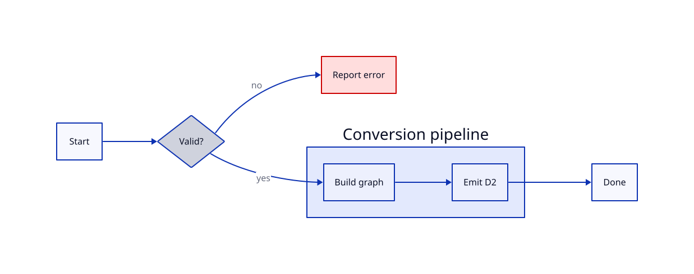
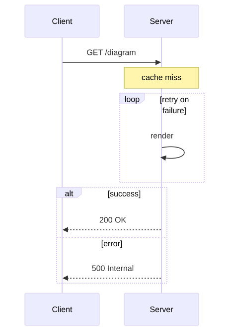
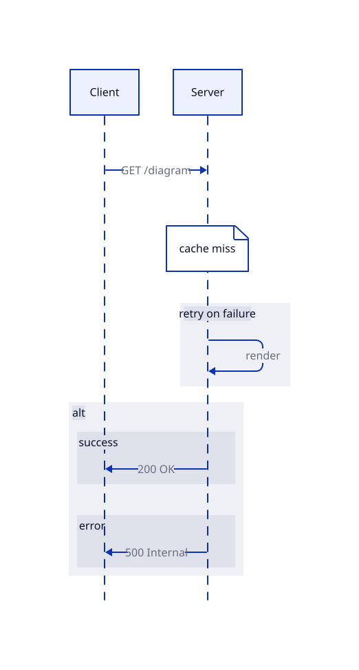
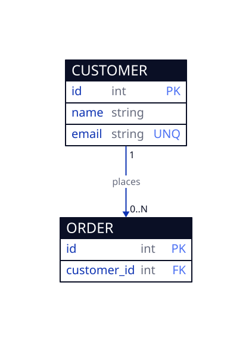
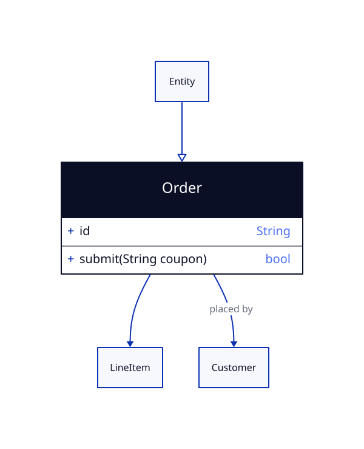
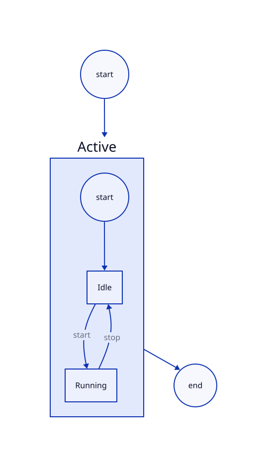

# mermaid2d2

Convert between [D2](https://d2lang.com) and [Mermaid](https://mermaid.js.org)
diagram syntax, as a Go library and a CLI (`m2d2`).

## Coverage

✅ supported · 🚧 planned · ❌ no equivalent in the other format

### Mermaid → D2

| Diagram | | Maps to |
|---|:--:|---|
| `flowchart` / `graph` | ✅ | shapes · edge styles · subgraphs · colors |
| `sequenceDiagram` | ✅ | messages · loop/alt/opt groups · notes |
| `stateDiagram-v2` | ✅ | states · transitions · composites · start/end |
| `classDiagram` | ✅ | members · UML arrowheads |
| `erDiagram` | ✅ | `sql_table` · keys · cardinalities |
| `mindmap` | ✅ | node tree · shapes |
| C4 | 🚧 | [#29](https://github.com/noamsto/mermaid2d2/issues/29) |
| pie · gantt · journey · xychart · gitGraph | ❌ | no D2 graph analog |

### D2 → Mermaid

| Feature | | Maps to |
|---|:--:|---|
| nodes · containers · connections · direction | ✅ | `flowchart` |
| `sql_table` | ✅ | `erDiagram` · keys · cardinalities |
| `class` | ✅ | `classDiagram` · members · UML arrowheads |
| `classes:`/`class:` styling | ✅ | flowchart `classDef`/`class` |
| mixed `sql_table`/`class`/plain shapes | ❌ | no single Mermaid diagram type |
| grids | ❌ | no Mermaid equivalent |

### Features

| | | |
|---|:--:|---|
| Label quoting (special chars) | ✅ | auto-quoted |
| Flowchart `classDef`/`class` colors | ✅ | ↔ D2 `classes` |
| State / class diagram notes | 🚧 | [#27](https://github.com/noamsto/mermaid2d2/issues/27) |
| Inline `style` · `:::class` | 🚧 | needs parser support in the fork |
| Sequence note side · spans · mindmap icons | ❌ | no D2 counterpart |

## Examples

Each pair below is a Mermaid source (left) and the D2 that `m2d2` produces from
it (right), both rendered to SVG. Regenerate with
[`docs/examples/generate.sh`](docs/examples/generate.sh).

### Flowchart

<table>
<tr><th>Mermaid</th><th>D2 — <code>m2d2</code> output</th></tr>
<tr>
<td width="50%"></td>
<td width="50%"></td>
</tr>
</table>

### Sequence

<table>
<tr><th>Mermaid</th><th>D2 — <code>m2d2</code> output</th></tr>
<tr>
<td width="50%"></td>
<td width="50%"></td>
</tr>
</table>

### Entity relationship

<table>
<tr><th>Mermaid</th><th>D2 — <code>m2d2</code> output</th></tr>
<tr>
<td width="50%"></td>
<td width="50%"></td>
</tr>
</table>

### Class

<table>
<tr><th>Mermaid</th><th>D2 — <code>m2d2</code> output</th></tr>
<tr>
<td width="50%"></td>
<td width="50%"></td>
</tr>
</table>

### State

<table>
<tr><th>Mermaid</th><th>D2 — <code>m2d2</code> output</th></tr>
<tr>
<td width="50%"></td>
<td width="50%"></td>
</tr>
</table>

## CLI

```sh
go install github.com/noamsto/mermaid2d2/cmd/m2d2@latest

m2d2 diagram.d2                 # -> Mermaid on stdout (target inferred from .d2)
m2d2 diagram.d2 -o diagram.mmd  # write to a file
cat diagram.d2 | m2d2 -to mermaid -   # read from stdin
```

The target format is inferred from the input extension (`.d2` → mermaid,
`.mmd`/`.mermaid` → d2) unless `-to` is given.

## Library

```go
import "github.com/noamsto/mermaid2d2"

out, err := mermaid2d2.D2ToMermaid(src)
d2, err := mermaid2d2.MermaidToD2(src)
```

Parsing uses [`noamsto/mermaid-check`](https://github.com/noamsto/mermaid-check),
a maintained fork of `sammcj/mermaid-check`.

## Development

The repo ships a Nix flake with a Go devShell, formatting, and pre-commit hooks:

```sh
direnv allow   # or: nix develop
go test ./...
```
